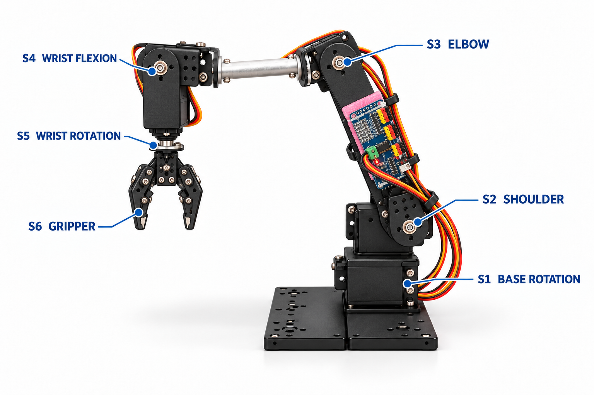
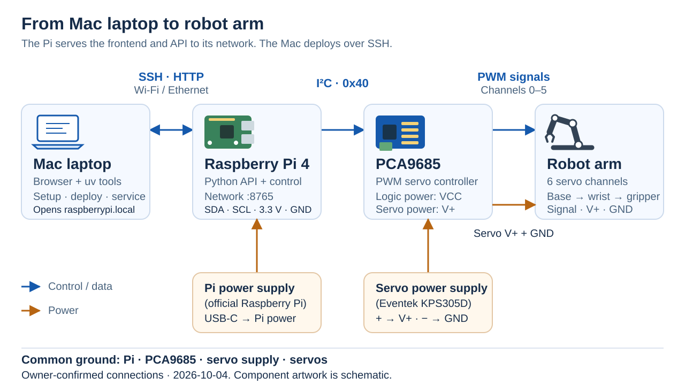

# Raspberry Pi robot arm starter

Python control software and a browser app for an existing six-servo desktop
arm driven by a Raspberry Pi and PCA9685. This repository is a hackathon
starting point and a documented reference for people using similar hardware.

<p align="center">
  <a href="web/home-illustration.png"></a>
</p>

The reference arm illustration labels servos S1–S6, corresponding to software
channels 0–5.

## System connections

<p align="center">
  <a href="docs/images/system-connections.svg"></a>
</p>

The Pi runs the frontend and API as a service on its Wi-Fi and Ethernet network;
the Mac laptop deploys over SSH and opens the app in a browser.
The Pi controls the arm through the PCA9685; the servos have a separate power
supply. The owner confirmed this setup and its wiring on 2026-10-04; see
[hardware wiring](docs/hardware.md#power-and-wiring) for connection details.

## Wiring

<p align="center">
  <a href="docs/images/wiring.svg"></a>
</p>

Click an image for the full-size version. The wiring diagram shows the confirmed
connections and physical Pi pin numbers. Component illustrations and pin
placement are schematic. See [hardware wiring](docs/hardware.md#power-and-wiring)
for the pin table and diagram regeneration command.

Start with the [laptop preview](docs/quickstart.md), then follow
[Pi preparation](docs/raspberry-pi.md) and [deployment](docs/deployment.md).
Read [hardware](docs/hardware.md) and [operations](docs/operations.md) before
powered operation.

## Run without hardware

Use `uv` and Python 3.12+ on macOS or Linux. Preview and tests use the locked
FastAPI and Uvicorn packages that `uv sync` installs; there is no frontend build step. Install [uv](https://docs.astral.sh/uv/getting-started/installation/), then create the locked project environment:

```sh
uv sync --locked
uv run --locked python scripts/manual_control.py
```

Open **http://127.0.0.1:8765/**. Read-only API state is at
**http://127.0.0.1:8765/api/state**. Preview simulates commands and writes
synthetic records; it is not a physics simulator.

## Connect and deploy

Configure `.pi.json` from `pi.example.json`. Provision SSH authentication and
verify the Pi's host fingerprint as described in the deployment guide.

```sh
uv run --locked python scripts/setup_connection.py --fingerprint 'SHA256:<verified fingerprint>'
uv run --locked python scripts/deploy.py
uv run --locked python scripts/setup_pi.py --install-system
uv run --locked python scripts/service.py install
```

`service.py install` runs the hardware app as a Pi service that also starts at
boot. Open **http://raspberrypi.local:8765/** from any device on the Pi's network.
Setup, deployment and app launch do not send servo commands; hardware is
initialized only by an attended Power on in the UI. Later deploys restart the app
and refuse while the arm is powered.

## What is available

- Manual joint movement, count jogs, PARK/HOME controls and Demo recording/playback.
- One application owner for motion, command validation and cancellation.
- A FastAPI HTTP API with JSON actions and Swagger docs at `/docs`, open to the local network; POSTs must come from the same-origin page.
- Configurable SSH key/password access, conflict-checked deployment and passive checks.
- A bundled, hash-locked Pi runtime for Linux aarch64 / CPython 3.13.

Observed PARK/HOME commands and historical joint ranges belong to the reference
arm. They do **not** establish measured position, validated travel, collision
clearance or full-arm supply capacity. Calibrated XYZ control and agent
implementations are outside this starter's scope.

## Repository map

| Path | Purpose |
| --- | --- |
| `scripts/` | Command entry points; thin launchers into `src/` |
| `src/roboter_arm/control/` | Session lifecycle, motion, HTTP API, drivers and commissioning checks |
| `src/roboter_arm/calibration/` | Calibration evidence rules and recording |
| `src/roboter_arm/provisioning/` | Laptop-side Pi connection, deployment, inspection and Wi-Fi tooling |
| `src/roboter_arm/shared/` | Joint catalog and repository root used by all contexts |
| `web/` | Existing HTML/CSS/JavaScript and reference illustrations |
| `config/reference-arm/` | Selected reference settings and observations |
| `pyproject.toml`, `uv.lock` | uv project metadata and laptop environment lock |
| `requirements/`, `runtime/` | Tested Pi dependency lock and matching wheels |
| `tests/` | Hardware-free control, HTTP and deployment tests |
| `docs/api.md` | Routes, request bodies, responses and extension boundary |
| `docs/architecture.md` | Responsibilities and dependency direction |

```sh
uv run --locked python -m unittest discover -s tests -p 'test_*.py'
```

The tests use fake drivers and temporary files; HTTP tests bind localhost.
See [contributing](CONTRIBUTING.md) for development and physical validation.
