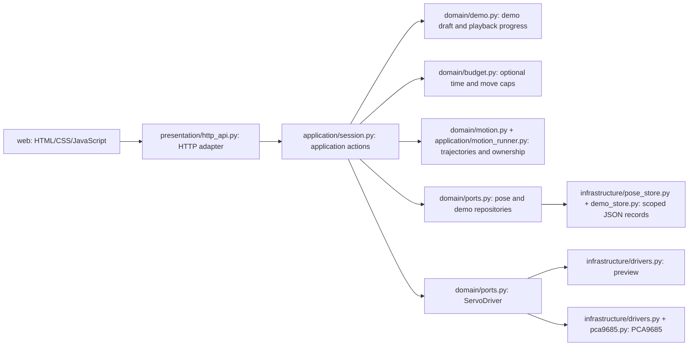

# Application boundaries

Python code lives in `src/roboter_arm/`, split into bounded contexts and layers.
`scripts/*.py` are thin entry points that put `src/` on `sys.path` and call a
context's `main`, so the Pi runs them from its isolated runtime without
installing the project. There is no framework, frontend build system or agent
implementation.

## Contexts

| Context | Runs on | Responsibility |
| --- | --- | --- |
| `control` | Pi; preview also on the laptop | Attended session, motion, demos, HTTP API, drivers, single-joint checks |
| `calibration` | Pi or laptop | Calibration evidence rules and append-only records |
| `provisioning` | Laptop | SSH and host keys, deployment manifest, inspection, Wi-Fi, app service |
| `shared` | Both | Joint catalog (`JOINTS`) and repository root (`ROOT`) |

`deploy.json` ships `shared`, `control` and `calibration`. `provisioning` stays
on the laptop.

## Layers and dependency rules

Each context has only the layers it needs:

- `domain`: rules without IO, such as trajectories, joint limits, the demo
  draft and playback rules, the optional session time and move caps, the ports, calibration evidence validation, Pi
  connection settings, deployable paths, Wi-Fi credentials and the inspection
  verdict.
- `application`: actions and orchestration: `Session`, `MotionRunner`, `Control`.
- `infrastructure`: adapters for the preview and PCA9685 drivers, PCA9685
  initialization, JSON records, SSH and remote payloads.
- `presentation`: HTTP API (FastAPI) and CLIs; these also compose the other layers.
  `provisioning` has no application layer: each command is one or two
  infrastructure calls composed in its CLI.

Dependencies point inward: presentation → infrastructure → application →
domain, and any layer may use `shared`. Contexts meet only where one context's
infrastructure applies another context's domain rules: control's `load_limits`
validates records with calibration's `validate`. `tests/test_architecture.py`
enforces these rules and that no module imports a hardware library at import
time.

## Control runtime

`http_api.py` serves static files from `web/`, handles JSON routes and maps
requests to `Session` actions. `Session` has no HTTP dependency and owns
validation, command state, readiness, worker execution and cancellation. The
`Demo` aggregate in `domain/demo.py` owns the recorded positions and playback
progress; `Session` guards and runs it. The browser renders state and submits
actions; it does not own motion or decide whether a target is allowed.

`domain/motion.py` calculates elapsed-time trajectories and
`application/motion_runner.py` enforces one driver owner. Neither imports a
hardware library. Drivers implement the `ServoDriver` port: `scope`, explicit
preparation, `write`, `disable`, output verification and close. Driver
construction performs no I2C access. Real controller initialization is isolated
in the explicit context manager in `infrastructure/pca9685.py`.

`infrastructure/pose_store.py` and `infrastructure/demo_store.py` keep scoped
JSON records behind the `PoseRepository` and `DemoRepository` ports.
`session_for` in `presentation/http_api.py` composes a `Session` with stores for
the driver's scope, and `Session` rejects stores from another scope.
`application/control.py` is the separate evidence-gated offline control
primitive and is not integrated into the commissioning app.

## Extending the API

Add application actions to `Session` and expose them through the HTTP adapter.
Route motion through the existing ownership and lifecycle rules. Keep transport
details out of application actions and hardware calls out of frontend/HTTP
code. New clients should use the application/API boundary rather than accessing
the driver directly. Put new code in the layer whose rules it follows and keep
`tests/test_architecture.py` passing.

Keep status distinct from position feedback and request acceptance distinct
from completion. Preserve preview default and explicit physical readiness. API
guards are documented in [API](api.md).

Session HTTP endpoints are plain `def` functions, which FastAPI runs in worker threads.
`Session` blocks on locks, so an `async def` endpoint calling it would stall the
event loop, Stop included. Stop is `async` only to hand
`session.stop` to its own thread limiter, so it never waits behind the shared
workers. Request models in `presentation/api_models.py` are strict and carry no
domain ranges; `Session` stays the authority. `tests/test_manual_api.py`
enforces these rules.

Optional camera access stays in `control`: `domain/camera.py` defines settings
policy, frame values and the source port; `application/camera.py` owns one
supervisor thread and an atomic latest RGB/depth pair;
`infrastructure/camera_process.py` implements the source port through a spawned
child and a private local socket. The child constructs `OakCamera`; the parent
never opens USB or loads DepthAI. `infrastructure/oak_camera.py` lazily loads
the pinned SDK and time-matches aligned depth with RGB.
`infrastructure/depth_images.py` encodes lossless metric PNGs and fixed-scale
colour previews once per producer frame. `presentation/camera_api.py` maps
camera errors and serves JPEG, PNG, live previews and paired capture through
the existing app. SDK calls and image encoding happen only in the child process.
One request/reply is in flight, without a frame backlog. Parent I/O uses an
eight-second startup or five-second read/control deadline, including incomplete transfers; returned sample
ages include transport time. Failures go through the existing camera-service
cache invalidation and reconnect path, with a new process and run ID. Shutdown
allows three seconds for native cleanup before terminate/kill escalation.
Spawn avoids inheriting prepared controller handles or locks. The child receives
no Session or servo driver, and camera-enabled service units let the parent
handle SIGTERM first with `KillMode=mixed`.

Capture and live previews are async exceptions that only inspect the short-lived cache
lock and await new frames. They do not call Session or USB I/O. Settings
admission briefly takes Session then camera locks, reserving `camera_pending`
against motion until a fresh post-dispatch frame arrives. Stop bypasses that
reservation. Camera failures never enter the Session action wrapper that stops
the arm. This is image access, with metric calibration readiness always false;
there is no autonomous executor or new bounded context.

The `provisioning` context is separate from this runtime. Its manifest ships
operational files only; it never prepares hardware or issues API actions.
