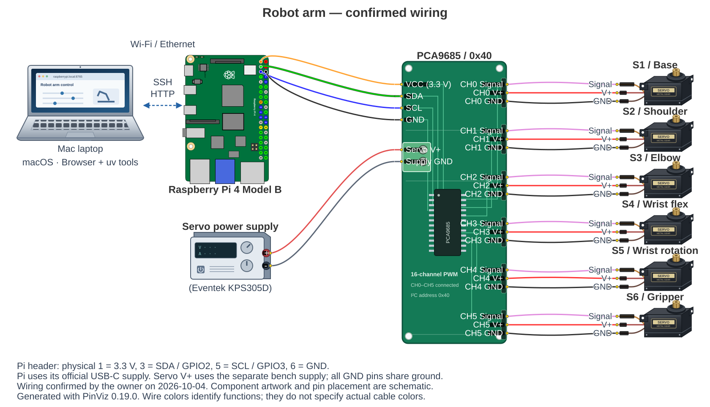

# Reference hardware

These are recorded findings from the owner's arm. The owner verified that the
wiring diagram matches the physical setup on 2026-10-04.

| Component | Recorded configuration |
| --- | --- |
| Operator computer | Mac laptop; browser and uv connection/deployment tools |
| Controller computer | Raspberry Pi 4 Model B Rev 1.1; official Pi power supply |
| OS/runtime | Raspberry Pi OS Lite 64-bit, Debian 13 Trixie, Python 3.13.5 |
| PWM board | Visually identified PCA9685; controller code uses I2C address `0x40` |
| Actuators | Six servo channels; one label confirmed DIY MORE MG996R; others reported to match |
| Servo supply | Separate regulated bench power supply (Eventek KPS305D) |
| Feedback | No measured joint-position feedback through this controller |

An earlier I2C scan also acknowledged `0x70`; that is not evidence of a second
independent controller. Code addresses `0x40`.

## Power and wiring

The confirmed arrangement separates Pi power, PCA9685 logic power and servo
power. The owner verified the following connections on the existing arm.

| Raspberry Pi / supply | PCA9685 connection |
| --- | --- |
| Pi physical pin 1 — 3.3 V | Logic VCC |
| Pi physical pin 3 — GPIO2 / SDA | SDA |
| Pi physical pin 5 — GPIO3 / SCL | SCL |
| Pi physical pin 6 — ground | GND |
| Separate regulated servo supply positive | Servo V+ |
| Servo supply ground | Common GND |

Pin numbers are physical header numbers, not BCM GPIO numbers. Component artwork
and pin placement in the illustration are schematic; use the printed board
labels for connector orientation.



The Mac deploys over SSH and opens the Pi's app in a browser, over Wi-Fi or Ethernet. That
network connection is drawn as a dashed blue line; solid lines show the wiring.

Channels 0–5 connect to S1–S6 respectively. Each servo uses its channel's signal,
V+ and GND pins. Servo V+ is shared across the channel headers, and Pi, board
and servo-supply grounds are common. The Pi keeps its separate USB-C supply.
Diagram wire colors distinguish functions; actual cable colors may differ.

Use board labels for the servo signal/V+/ground connector orientation. Servos
draw from the separate supply, not the Pi power rail. See Adafruit's
[Pi wiring guide](https://learn.adafruit.com/16-channel-pwm-servo-driver/python-circuitpython)
and [power/connector guidance](https://learn.adafruit.com/16-channel-pwm-servo-driver/hooking-it-up).

The recorded unloaded gripper check used 5.0 V with a 1.0 A current limit.
That observation does not specify a supply setting capable of operating all
six servos under load. Full-arm supply capacity remains unvalidated.

The SVG is generated with [PinViz](https://github.com/nordstad/PinViz), using its
Pi 4 pin definitions, wire routing and programmatic board renderer, plus the
original component artwork in [wiring-components.svg](images/wiring-components.svg).
To regenerate it from the repository root:

```sh
uv run docs/generate_wiring.py
```

The script pins PinViz 0.19.0 in its uv script metadata. It is a documentation
tool dependency; the robot's runtime dependencies do not change.

## Channel mapping

| Channel | Assignment | Historical count guard |
| --- | --- | --- |
| 0 | Base rotation | 90–660 |
| 1 | Shoulder pitch | 185–660 |
| 2 | Elbow pitch | 90–660 |
| 3 | Wrist flexion | 90–660 |
| 4 | Wrist rotation | 90–660 |
| 5 | Gripper | 490–660 |

The owner accepted the existing mapping. Shoulder/elbow descriptions follow
chain order; their axes remain unmeasured. Channels 3, 4 and 5 had narrow
attended checks with selected-joint movement reported normal. Counts, direction
and mechanical angle are different quantities; these ranges are inherited
guards, not measured safe travel.

The app includes reference illustrations in `web/`. They are UI illustrations,
not verified wiring photographs. Actual connection photos, measured geometry,
joint zeros and a demonstrated support/cradle arrangement remain documentation
and commissioning work. See [calibration](calibration.md) and
[operations](operations.md).
